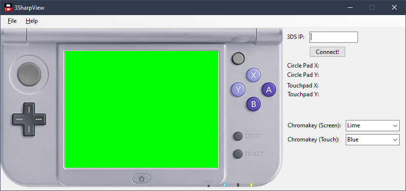

# 3SharpView
A C# Viewer for 3Input

## Features
Connects to the 3Input Viewer server on your 3DS to read the JSON Inputs and present meaningful information on what has been pressed/moved on your 3DS!

Current feature-set:
- ABXY
- Thumb Stick
- L/R
- Start/Select
- Touch Screen
- Adjustable Chromakey for touch screen and touch point (either in plain text, or hex code!).

## Contributors/Credit
- [Gaby](https://twitter.com/gabyelnuevo) for helping test the first iterations of this.

## Building
 - [Visual Studio 2019](https://visualstudio.microsoft.com/downloads/)

 Open the Solution file (`.sln`) in Visual Studio, and build! Compiled executables will be on the Releases page on this repository.

## Screenshot

## TODO
- ZL/ZR
- Possible change of theme via drop-down?

## License
This project is licensed under [GNU GENERAL PUBLIC LICENSE V3](https://www.gnu.org/licenses/gpl-3.0.en.html). Feel free to distribute, contribute, and make changes! Pull requests to improve functionality is always welcome!
